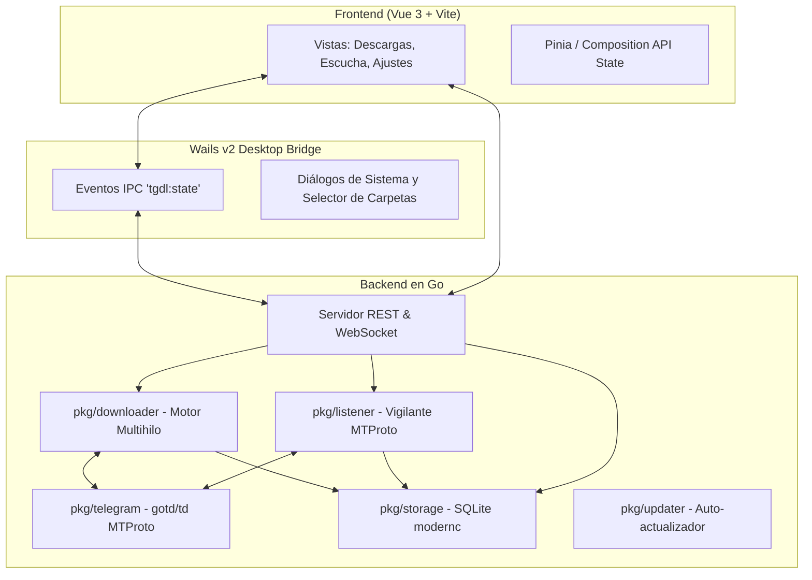

**TelegramDL** implementa una arquitectura modular desacoplada en Go, diseñada para garantizar máxima velocidad, bajo consumo de recursos y total independencia entre el motor de descarga, la interfaz de usuario y la persistencia de datos.

---

## Diagrama de Componentes

---

## Estructura de Paquetes (`pkg/`)

- **`pkg/telegram`**: Gestiona el ciclo de vida del cliente MTProto nativo mediante `gotd/td`. Se encarga del handshake de red, autenticación (SMS, app, 2FA con SRP), resolución de `AccessHash` y sincronización segura antes de iniciar descargas (`WaitReady`).
- **`pkg/downloader`**: Núcleo de descarga por fragmentos. Maneja la partición en bloques de 512 KB, la asignación de hasta 8 workers concurrentes por archivo, el semáforo global de concurrencia, reanudación y prevención de duplicados.
- **`pkg/listener`**: Recibe y filtra eventos de mensajes en tiempo real desde Telegram. Aplica las reglas por chat y tipo de archivo para autodescarga o puesta a disposición manual.
- **`pkg/storage`**: Capa de persistencia en SQLite (`modernc.org/sqlite`, 100% Go puro sin CGO). Gestiona migraciones automáticas, lecturas y escrituras seguras con concurrencia.
- **`pkg/server`**: Servidor HTTP REST y WebSocket para comunicación interna y control remoto. Proporciona snapshots reactivos de estado en tiempo real.
- **`pkg/updater`**: Consulta la API de GitHub en segundo plano para verificar nuevas versiones y aplicar autoactualizaciones seguras.
- **`pkg/logbus`**: Sistema de buses de registro en memoria con retención controlada para visualización y exportación de logs.

---

## Esquema de Base de Datos SQLite

La base de datos se almacena en `~/.tgdown/tgdown.sqlite3` y cuenta con las siguientes tablas principales:

### 1. Tabla `downloads`
Registra el historial y estado de cada archivo transferido:

| Campo | Tipo | Descripción |
| :--- | :--- | :--- |
| `id` | `TEXT PRIMARY KEY` | UUID único de la descarga |
| `job_id` | `TEXT` | ID de lote para descargas por rangos |
| `message_id` | `INTEGER` | ID del mensaje en Telegram |
| `chat_id` | `INTEGER` | ID del chat/canal MTProto (prefijo `-100`) |
| `file_name` | `TEXT` | Nombre final del archivo |
| `status` | `TEXT` | `queued`, `downloading`, `paused`, `completed`, `skipped`, `failed`, `cancelled` |
| `progress` | `REAL` | Porcentaje de progreso de 0.0 a 100.0 |
| `speed` | `TEXT` | Velocidad calculada en vivo (ej. "12.50 MB/s") |
| `kind` | `TEXT` | Tipo (`file`, `video`, `song`, `photo`, `sticker`) |
| `file_path` | `TEXT` | Ruta absoluta de guardado en el sistema |
| `source` | `TEXT` | Origen de la descarga (`manual` o `listener`) |
| `total_bytes` | `INTEGER` | Tamaño total del archivo en bytes |
| `current_bytes`| `INTEGER` | Bytes descargados hasta el momento |

### 2. Tabla `listener_chats`
Almacena los canales y grupos vigilados y sus reglas de filtrado:

| Campo | Tipo | Descripción |
| :--- | :--- | :--- |
| `chat_id` | `INTEGER PRIMARY KEY` | ID de Telegram del chat vigilado |
| `name` | `TEXT` | Nombre del canal o grupo |
| `auto_download` | `INTEGER` | `1` para descarga automática, `0` solo detectar |
| `f_photos` | `INTEGER` | Filtro de fotos activado (`1` o `0`) |
| `f_videos` | `INTEGER` | Filtro de vídeos activado (`1` o `0`) |
| `f_audios` | `INTEGER` | Filtro de música/audio activado (`1` o `0`) |
| `f_docs` | `INTEGER` | Filtro de documentos activado (`1` o `0`) |
| `f_stickers` | `INTEGER` | Filtro de stickers activado (`1` o `0`) |

### 3. Tabla `download_chunks`
Controla los bloques completados de cada descarga para permitir reanudar sin perder progreso:

| Campo | Tipo | Descripción |
| :--- | :--- | :--- |
| `download_id` | `TEXT` | Referencia al UUID de la descarga |
| `part_index` | `INTEGER` | Número secuencial del bloque |
| `offset_bytes` | `INTEGER` | Desplazamiento en bytes dentro del archivo |
| `part_size` | `INTEGER` | Tamaño del fragmento (normalmente 512 KB) |
