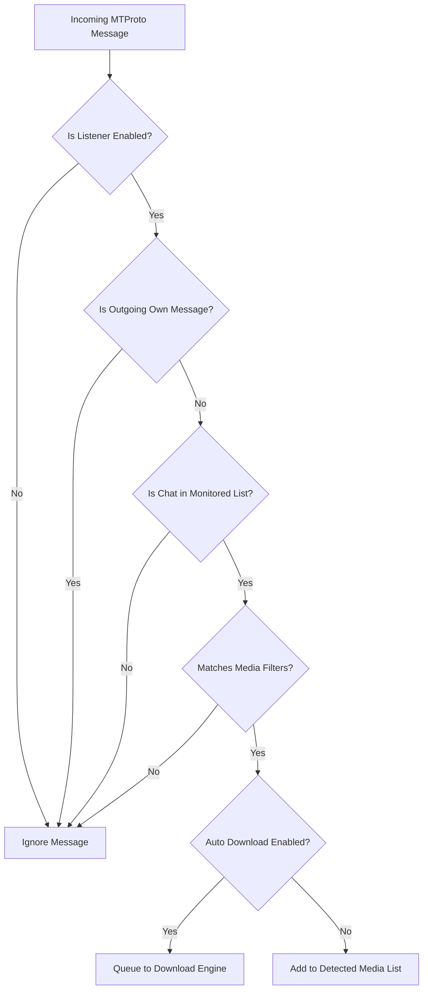

The **Listener Mode** transforms TelegramDL into an automated, real-time background monitor for your Telegram channels, groups, and chats.

---

## How the Listener Works

The listener engine (`pkg/listener/listener.go`) registers directly into the Telegram MTProto event dispatcher:

---

## Granular Media Filters

Each monitored chat or channel can be configured with distinct content filters:

- **Photos**: Direct images and screenshots.
- **Videos**: Movies, TV shows, video clips, and animations.
- **Audios / Music**: Songs, voice memos, and audio tracks.
- **Documents / Files**: Archives (`.zip`, `.rar`, `.7z`), PDFs, software installers, etc.
- **Stickers**: Static and animated stickers.

---

## Operating Modes

### 1. Automatic Download (`AutoDownload = true`)
Any incoming media matching your filter criteria is immediately enqueued into the active download pipeline and starts downloading with no manual interaction.

### 2. Manual Detection (`AutoDownload = false`)
Files are staged under the **"Detected Media"** tab with status `available`. You can inspect names, thumbnails, and file sizes, and selectively download items or click **"Download All"**.

---

## Forum Topics Support

TelegramDL natively supports forum supergroups with topics:

- Monitor the **entire group** (all topics).
- Or pin a **specific topic** (e.g. only watch the *"4K Movies"* topic while ignoring other discussions).
- Topic metadata and names are resolved dynamically via the `/api/listener/topics` endpoint.

---

## Important Isolation Rule

:::note
**Manual link downloads are never restricted by Listener filters.**
If you paste a direct message link to a photo in the Downloads tab, it will download even if photos are unchecked for that chat in Listener settings. Listener filters exclusively apply to incoming real-time messages.
:::
