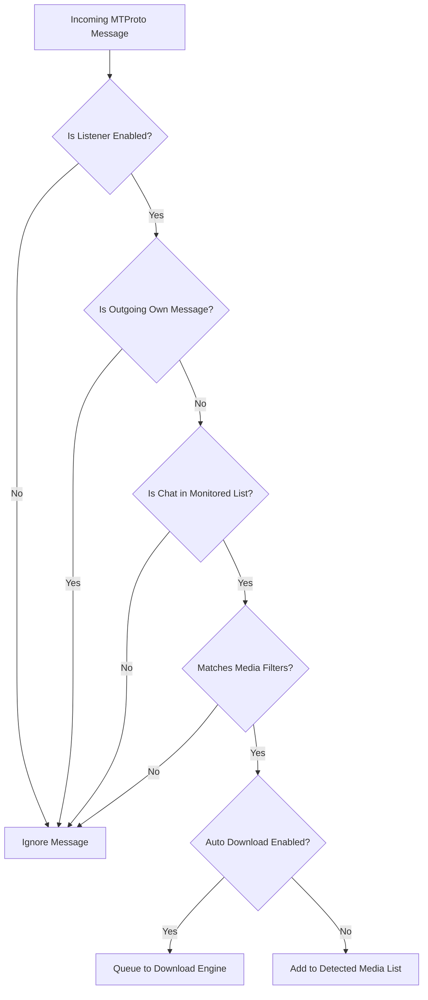

The **Listener Mode** transforms TelegramDL into an automated, real-time background monitor for your Telegram channels, groups, and chats.

---

## How the Listener Works

The listener engine (`pkg/listener/listener.go`) registers directly into the Telegram MTProto event dispatcher:

```mermaid
flowchart TD
    Update[Incoming MTProto Message] --> CheckEnabled{Is Listener Enabled?}
    CheckEnabled -- No --> Ignore[Ignore Message]
    CheckEnabled -- Yes --> CheckOwn{Is Outgoing Own Message?}
    CheckOwn -- Yes --> Ignore
    CheckOwn -- No --> CheckChat{Is Chat in Monitored List?}
    CheckChat -- No --> Ignore
    CheckChat -- Yes --> FilterCheck{Matches Media Filters?}
    FilterCheck -- No --> Ignore
    FilterCheck -- Yes --> AutoCheck{Auto Download Enabled?}
    AutoCheck -- Yes --> Queue[Queue to Download Engine]
    AutoCheck -- No --> Detected[Add to Detected Media List]
```

---

## Granular Media Filters

Each monitored chat or channel can be configured with distinct content filters:

- **Photos**: Direct images and screenshots.
- **Videos**: Movies, TV shows, video clips, and animations.
- **Audios / Music**: Songs, voice memos, and audio tracks.
- **Documents / Files**: Archives (`.zip`, `.rar`, `.7z`), PDFs, software installers, etc.
- **Stickers**: Static and animated stickers.

---

## Operating Modes

### 1. Automatic Download (`AutoDownload = true`)

Any incoming media matching your filter criteria is immediately enqueued into the active download pipeline and starts downloading with no manual interaction.

### 2. Manual Detection (`AutoDownload = false`)

Files are staged under the **"Detected Media"** tab with status `available`. You can inspect names, thumbnails, and file sizes, and selectively download items or click **"Download All"**.

---

## File Renaming System

TelegramDL allows you to customize the final file names of detected media before enqueuing them for download.

### Per-Chat "Nombre" (Name) Switch

In the **Monitored Chats** list, each chat entry features a **Nombre** toggle switch:

- **Activated: Original**: All files from that chat will retain the original name they had when uploaded to Telegram..

- **Activated: caption**: All files from that chat captured during monitoring will be named based on the caption (message caption); only the first line will be used, up to a maximum of 50 characters.

- **Disabled**: You must set this manually if you want the original filename or the caption for each file in the list—or apply it in bulk; the caption is used by default.

  - **Original**: Original file name
  - **Caption**:  caption (`message footer`) available

In the **Detected Media** list, for any item belonging to a chat where the **Name** option is disabled, a **Name** button is available to manually select a desired name for each file. Alternatively, if you wish to apply a name to all such files at once, there is a dedicated button at the top of the list that allows you to batch-assign either the original filename or the caption to all files from a chat that does not have the naming option enabled.
---

## Forum Topics Support

TelegramDL natively supports forum supergroups with topics:

- Monitor the **entire group** (all topics).
- Or pin a **specific topic** (e.g. only watch the *"Important documents"* topic while ignoring other discussions).
- Topic metadata and names are resolved dynamically via the `/api/listener/topics` endpoint.

---

## Important Isolation Rule

:::note
**Manual link downloads are never restricted by Listener filters.**
If you paste a direct message link to a photo in the Downloads tab, it will download even if photos are unchecked for that chat in Listener settings. Listener filters exclusively apply to incoming real-time messages.
:::
