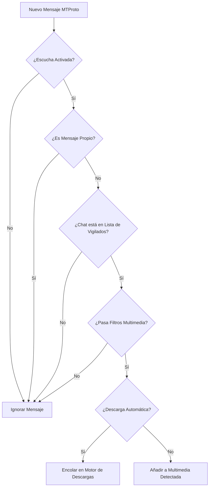

El **Modo Escucha** de TelegramDL convierte la aplicación en un receptor automatizado y vigilante en tiempo real de canales, grupos y chats de Telegram.

---

## ¿Cómo Funciona la Escucha?

El motor de escucha (`pkg/listener/listener.go`) se conecta directamente al despachador de eventos MTProto de Telegram:

---

## Filtros Granulares por Tipo de Contenido

Para cada canal o grupo que agregues a la escucha, puedes configurar filtros independientes:

- **Fotos**: Imágenes y capturas directas.
- **Vídeos**: Películas, series, clips y animaciones de vídeo.
- **Audios / Música**: Canciones, notas de voz y pistas de audio.
- **Documentos / Archivos**: Archivos comprimidos (`.zip`, `.rar`, `.7z`), PDFs, instaladores, etc.
- **Stickers**: Stickers estáticos y animados.

---

## Modos de Operación

### 1. Descarga Automática (`AutoDownload = true`)
Cualquier archivo entrante que cumpla con los filtros seleccionados se envía inmediatamente a la cola de descargas activas y comienza a transferirse sin intervención del usuario.

### 2. Detección Manual (`AutoDownload = false`)
Los archivos se registran en la pestaña **"Multimedia Detectada"** con estado disponible. Podrás revisar la lista con vista previa, tamaño y título, y decidir con un solo clic si deseas descargar elementos específicos o pulsar **"Descargar Todo"**.

---

## Soporte para Temas y Foros (Topics)

TelegramDL incluye soporte para supergrupos con temas organizados:

- Puedes vigilar el **grupo completo** (todos los temas).
- O puedes seleccionar un **tema específico** (por ejemplo, vigilar solo el tema *"Películas 4K"* e ignorar el resto de temas del grupo).
- El sistema resuelve los nombres de los temas automáticamente mediante el endpoint `/api/listener/topics`.

---

## Regla Importante de Aislamiento

:::note
**Las descargas manuales introducidas mediante enlace nunca se ven afectadas por los filtros del Listener.**
Si pegas un enlace directo a una foto en la pestaña de descargas, se descargará aunque en la configuración de ese canal tengas desmarcada la opción de fotos. Los filtros del Listener solo aplican a los mensajes entrantes en tiempo real.
:::
