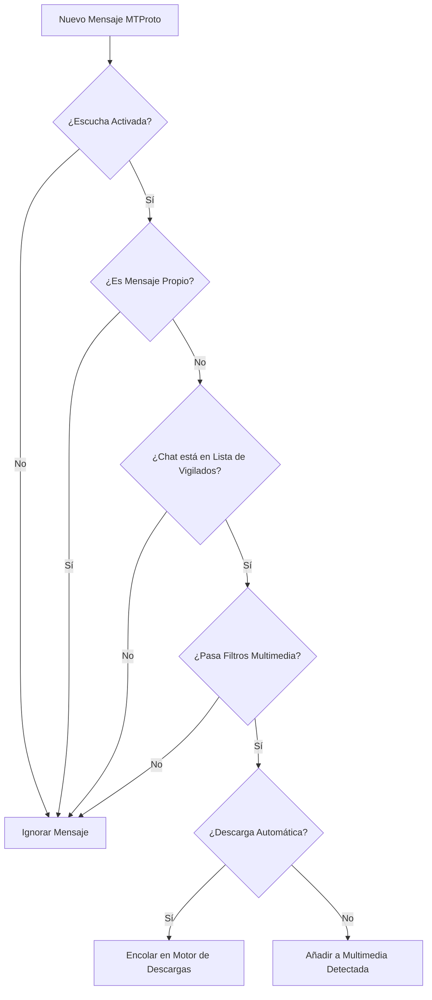

El **Modo Escucha** de TelegramDL convierte la aplicación en un receptor automatizado y vigilante en tiempo real de canales, grupos y chats de Telegram.

---

## ¿Cómo Funciona la Escucha?

El motor de escucha (`pkg/listener/listener.go`) se conecta directamente al despachador de eventos MTProto de Telegram:

```mermaid
flowchart TD
    Update[Nuevo Mensaje MTProto] --> CheckEnabled{¿Escucha Activada?}
    CheckEnabled -- No --> Ignore[Ignorar Mensaje]
    CheckEnabled -- Sí --> CheckOwn{¿Es Mensaje Propio?}
    CheckOwn -- Sí --> Ignore
    CheckOwn -- No --> CheckChat{¿Chat está en Lista de Vigilados?}
    CheckChat -- No --> Ignore
    CheckChat -- Sí --> FilterCheck{¿Pasa Filtros Multimedia?}
    FilterCheck -- No --> Ignore
    FilterCheck -- Sí --> AutoCheck{¿Descarga Automática?}
    AutoCheck -- Sí --> Queue[Encolar en Motor de Descargas]
    AutoCheck -- No --> Detected[Añadir a Multimedia Detectada]
```

---

## Filtros Granulares por Tipo de Contenido

Para cada canal o grupo que agregues a la escucha, puedes configurar filtros independientes:

- **Fotos**: Imágenes y capturas directas.
- **Vídeos**: Películas, series, clips y animaciones de vídeo.
- **Audios / Música**: Canciones, notas de voz y pistas de audio.
- **Documentos / Archivos**: Archivos comprimidos (`.zip`, `.rar`, `.7z`), PDFs, instaladores, etc.
- **Stickers**: Stickers estáticos y animados.

---

## Modos de Operación

### 1. Descarga Automática (`AutoDownload = true`)

Cualquier archivo entrante que cumpla con los filtros seleccionados se envía inmediatamente a la cola de descargas activas y comienza a transferirse sin intervención del usuario.

### 2. Detección Manual (`AutoDownload = false`)

Los archivos se registran en la pestaña **"Multimedia Detectada"** con estado disponible. Podrás revisar la lista con vista previa, tamaño y título, y decidir con un solo clic si deseas descargar elementos específicos o pulsar **"Descargar Todo"**.

---

## Sistema de Selección y Renombrado de Archivos

TelegramDL permite personalizar el nombre final de los archivos detectados antes de agregarlos a la cola de descargas.

### Conmutador "Nombre" por Chat Vigilado

En la sección de **Chats Vigilados**, cada origen cuenta con un interruptor **Nombre**:

- **Activado: Original**: todos los archivos de ese chat en la escucha tomaran el nombre original con el que se subió a telegram.

- **Activado: caption**: todos los archivos de ese chat en la escucha tomaran el nombre basado en el caption (`pie de mensaje`), solo tendrá en cuenta la primera línea con un máximo de 50 caractéres.

- **Desactivado**: Debe poner manual si desea el nombre original o el caption en cada archivo de la lista o de forma masiva, por defecto se usa le caption.

  - **Original**: Nombre original del archivo
  - **Caption**:  caption (`pie de mensaje`) disponible

En la lista de **Multimedia Detectada**, cada elemento perteneciente a un chat con la opción **Nombre** desactivada dispone de un botón **Nombre** para elegir de forma manual el nombre deseado por archivo o si desea que todos de golpe tomen un nombre arriba de la lista hay un botón dedicado con el que todos los archivos pertenecientes a un chat que no tiene la opción de un nombre activa se le puede asignar de forma masiva el nombre original o el caption

---

## Soporte para Temas y Foros (Topics)

TelegramDL incluye soporte para supergrupos con temas organizados:

- Puedes vigilar el **grupo completo** (todos los temas).
- O puedes seleccionar un **tema específico** (por ejemplo, vigilar solo el tema *"Documentos importantes"* e ignorar el resto de temas del grupo).
- El sistema resuelve los nombres de los temas automáticamente mediante el endpoint `/api/listener/topics`.

---

## Regla Importante de Aislamiento

:::note
**Las descargas manuales introducidas mediante enlace nunca se ven afectadas por los filtros del Listener.**
Si pegas un enlace directo a una foto en la pestaña de descargas, se descargará aunque en la configuración de ese canal tengas desmarcada la opción de fotos. Los filtros del Listener solo aplican a los mensajes entrantes en tiempo real.
:::
