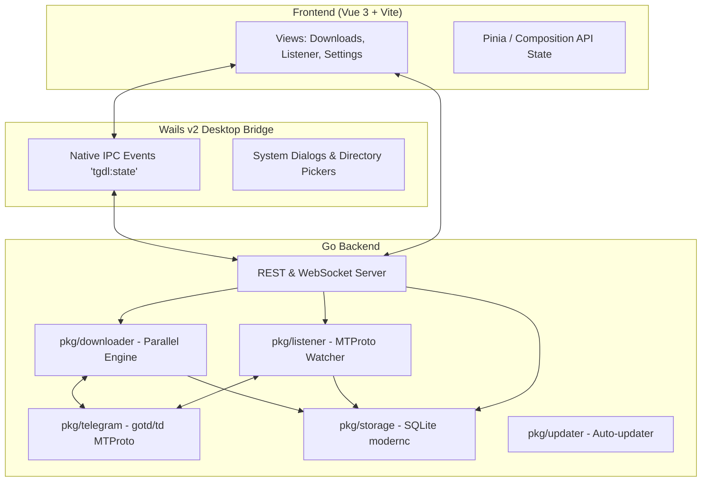

# Architecture & Database

**TelegramDL** implements a modular, decoupled Go architecture designed to achieve high transfer speeds, low memory footprint, and complete independence between the download engine, user interface, and data persistence layers.

---

## 🏗️ Component Diagram

---

## 📦 Package Structure (`pkg/`)

- **`pkg/telegram`**: Manages native MTProto client lifecycle using `gotd/td`. Handles network handshakes, authentication (SMS, Telegram app, 2FA via SRP), entity cache, `AccessHash` resolution, and download readiness gating (`WaitReady`).
- **`pkg/downloader`**: Parallel chunk download engine. Handles 512 KB chunk slicing, scheduling up to 8 parallel workers per task, global concurrency semaphores, automatic resume, and duplicate avoidance.
- **`pkg/listener`**: Evaluates real-time message events from Telegram. Applies chat and media type filters to trigger automatic downloads or register items for manual review.
- **`pkg/storage`**: SQLite persistence layer (`modernc.org/sqlite`, 100% pure Go without CGO). Handles schema migrations, transactions, and concurrent safe reads/writes.
- **`pkg/server`**: HTTP REST and WebSocket server for internal desktop communication and remote access. Emits reactive state snapshots.
- **`pkg/updater`**: Background GitHub release checker and in-place application updater.
- **`pkg/logbus`**: Memory-buffered log streaming with retention policies for real-time monitoring and file exports.

---

## 🗄️ SQLite Database Schema

The database resides at `~/.tgdown/tgdown.sqlite3` and contains the following core tables:

### 1. `downloads` Table
Tracks all past and active transfer tasks:

| Column | Type | Description |
| :--- | :--- | :--- |
| `id` | `TEXT PRIMARY KEY` | Unique download UUID |
| `job_id` | `TEXT` | Batch identifier for range downloads |
| `message_id` | `INTEGER` | Telegram message identifier |
| `chat_id` | `INTEGER` | MTProto Chat/Channel ID (prefixed with `-100`) |
| `file_name` | `TEXT` | Target filename on disk |
| `status` | `TEXT` | `queued`, `downloading`, `paused`, `completed`, `skipped`, `failed`, `cancelled` |
| `progress` | `REAL` | Progress percentage from 0.0 to 100.0 |
| `speed` | `TEXT` | Formatted transfer speed (e.g. "12.50 MB/s") |
| `kind` | `TEXT` | Media category (`file`, `video`, `song`, `photo`, `sticker`) |
| `file_path` | `TEXT` | Absolute path on disk |
| `source` | `TEXT` | Origin of the download (`manual` or `listener`) |
| `total_bytes` | `INTEGER` | Total file size in bytes |
| `current_bytes`| `INTEGER` | Downloaded bytes so far |

### 2. `listener_chats` Table
Maintains monitored channels and their filter rules:

| Column | Type | Description |
| :--- | :--- | :--- |
| `chat_id` | `INTEGER PRIMARY KEY` | Monitored Telegram chat ID |
| `name` | `TEXT` | Chat or channel title |
| `auto_download` | `INTEGER` | `1` for auto download, `0` for manual staging |
| `f_photos` | `INTEGER` | Photos filter enabled (`1` or `0`) |
| `f_videos` | `INTEGER` | Videos filter enabled (`1` or `0`) |
| `f_audios` | `INTEGER` | Audio/music filter enabled (`1` or `0`) |
| `f_docs` | `INTEGER` | Documents filter enabled (`1` or `0`) |
| `f_stickers` | `INTEGER` | Stickers filter enabled (`1` or `0`) |

### 3. `download_chunks` Table
Tracks completed chunks per download to allow resumption without data loss:

| Column | Type | Description |
| :--- | :--- | :--- |
| `download_id` | `TEXT` | Foreign key referencing `downloads.id` |
| `part_index` | `INTEGER` | Sequential chunk index |
| `offset_bytes` | `INTEGER` | Byte offset within the target file |
| `part_size` | `INTEGER` | Chunk byte size (typically 512 KB) |
