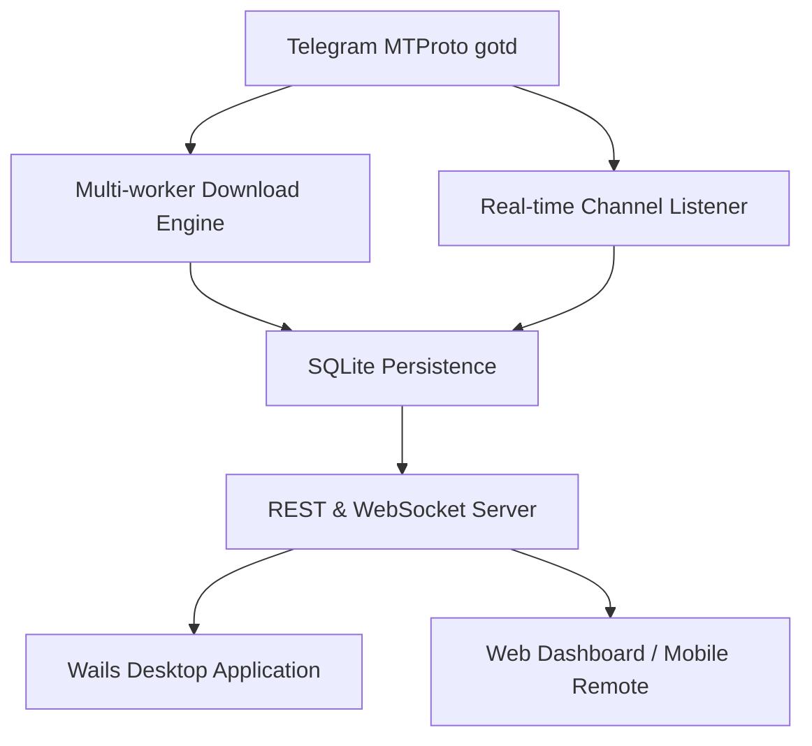

# TelegramDL (TGDown)

Welcome to the official documentation for **TelegramDL**, a high-performance desktop Telegram download manager.

TelegramDL is built with **Go**, **Wails v2**, and **Vue 3**, combining an ultra-fast, concurrent backend with a modern, responsive, and lightweight user interface.

---

## :material-target: What TelegramDL IS and is NOT

- :material-check-bold: **IS a specialized download manager**: Exclusively engineered to download documents, videos, audio files, photos, and stickers at peak speeds, featuring parallel chunk downloading, message range support, real-time channel monitoring, and remote control.
- :material-close-thick: **IS NOT a chat client**: It is not designed for messaging, voice/video calls, or contact management. Its sole mission is to **receive, monitor, and download media content**.

---

## :material-lightning-bolt: Key Highlights

- **Parallel Chunk Downloading**: Slices files into 512 KB chunks with up to 8 parallel workers per download.
- **Message Range Downloads**: Download continuous message sequences with range URLs (e.g. `https://t.me/c/2121902112/100-150`).
- **Channels and Forum Topics**: Support for downloading specific topics or monitoring entire forum supergroups.
- **Automatic Resume**: Resumes interrupted transfers from previously saved chunks without starting over.
- **Background Listener**: Continuously monitors monitored chats and channels with media filters (photos, videos, songs, documents, stickers) and optional auto-download.
- **Secure Remote Access**: Control TelegramDL from your mobile phone or another PC on your LAN via Bearer token authentication and one-click token delivery to your Telegram *Saved Messages*.
- **Headless Server Mode**: Run without a GUI using the `--server` CLI flag for home servers, NAS devices, or background daemons.
- **Pure Local SQLite**: All transfer history, settings, and chunk checkpoints are managed with `modernc.org/sqlite` (no CGO or external database required).

---

## :material-rocket-launch: Quick Navigation

-   :material-rocket-launch: **[Getting Started](getting-started.md)**

    ---

    System prerequisites, obtaining Telegram API credentials, and initial launch.

-   :material-download: **[Features](features.md)**

    ---

    Direct downloads, message ranges, forum topics, and concurrency controls.

-   :material-ear-hearing: **[Listener Mode](listener.md)**

    ---

    Channel monitoring setup, granular media filtering, and automatic downloads.

-   :material-cellphone-link: **[Remote Access](remote-access.md)**

    ---

    Mobile device control, security tokens, and local/remote networking setups.

-   :material-api: **[API Reference](api-reference.md)**

    ---

    Exhaustive documentation of REST endpoints and real-time WebSocket state streaming.

-   :material-console: **[CLI & Modes](cli.md)**

    ---

    Terminal flags, running in headless server mode, and auto-updates.

