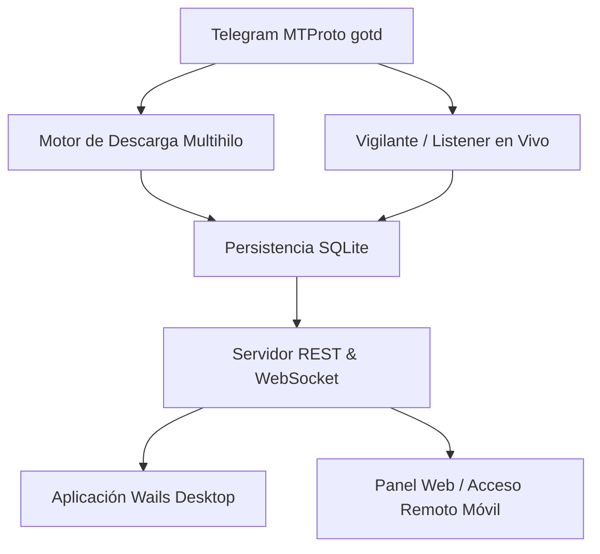

# TelegramDL (TGDown)

Bienvenido a la documentación oficial de **TelegramDL**, un gestor de descargas de alto rendimiento para Telegram diseñado para sistemas de escritorio.

TelegramDL está desarrollado en **Go**, **Wails v2** y **Vue 3**, combinando un backend ultrarrápido y concurrente con una interfaz moderna, reactiva y ligera.

---

## :material-target: ¿Qué es y qué no es TelegramDL?

- :material-check-bold: **ES un gestor especializado de descargas**: Diseñado exclusivamente para descargar documentos, vídeos, archivos de audio, fotos y stickers a máxima velocidad, con soporte para descargas por fragmentos paralelos, rangos de mensajes, vigilancia de canales y control remoto.
- :material-close-thick: **NO es un cliente de mensajería**: No está pensado para chatear, enviar mensajes de texto, llamadas ni gestionar contactos. Su único propósito es **recibir, vigilar y descargar contenido multimedia**.

---

## :material-lightning-bolt: Características Principales

- **Descargas multihilo por fragmentos**: Divide cada archivo en bloques de 512 KB con hasta 8 workers en paralelo por descarga.
- **Soporte para rangos de mensajes**: Descarga múltiples mensajes continuos utilizando URLs de rango (por ejemplo, `https://t.me/c/2121902112/100-150`).
- **Canales y grupos con temas (topics)**: Capacidad para descargar temas específicos o escuchar grupos completos con subtemas organizados.
- **Reanudación automática**: Reanuda descargas incompletas desde los fragmentos ya guardados sin tener que reiniciar desde cero.
- **Vigilante en segundo plano (Listener)**: Monitorea canales y grupos en tiempo real con filtros por tipo de multimedia (fotos, vídeos, audios, documentos o stickers) y autodescarga opcional.
- **Acceso Remoto Protegido**: Controla la aplicación desde tu teléfono u otra PC en la red local mediante autenticación segura por Token Bearer y envío a tus *Mensajes Guardados*.
- **Modo Servidor Headless**: Puede ejecutarse sin interfaz gráfica mediante el parámetro `--server` para servidores domésticos, NAS o segundo plano.
- **Base de datos SQLite local**: Todo el historial, la configuración y el estado de fragmentos se gestionan mediante `modernc.org/sqlite` (sin CGO ni dependencias externas).

---

## :material-rocket-launch: Navegación Rápida

-   :material-rocket-launch: **[Primeros Pasos](getting-started.md)**

    ---

    Requisitos del sistema, obtención de credenciales de Telegram y primera ejecución.

-   :material-download: **[Funcionalidades](features.md)**

    ---

    Descargas directas, rangos de mensajes, grupos con temas y control de concurrencia.

-   :material-ear-hearing: **[Modo Escucha](listener.md)**

    ---

    Configuración de monitoreo de canales, filtros por extensión y descarga automática.

-   :material-cellphone-link: **[Acceso Remoto](remote-access.md)**

    ---

    Control desde dispositivos móviles, seguridad con tokens y configuración de red.

-   :material-api: **[Referencia de API](api-reference.md)**

    ---

    Catálogo completo de endpoints REST y suscripción en tiempo real por WebSocket.

-   :material-console: **[Comandos CLI](cli.md)**

    ---

    Modos de terminal, ejecución en modo servidor y autoactualizaciones.

